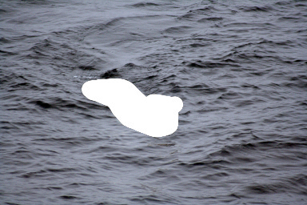
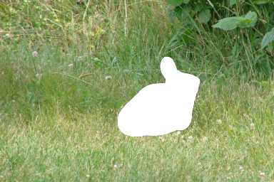

# PyTorch UNet

My PyTorch implementation of the inpainting method described in the paper Deep Image Prior by Ulyanov et al. ( https://dmitryulyanov.github.io/deep_image_prior ). This paper is particulary interesting because it shows that convolutional neural networks are a useful prior for natural images, even without any training on other images.

Masked image            |  Output during learning | Finished output
:-------------------------:|:-------------------------:
  |   | 

Masked image            |  Output during learning | Finished output
:-------------------------:|:-------------------------:
  |   | 

## Requirements

- Python3
- PyTorch
- torchvision
- PILlow
- numpy

## Usage

Example usage:

```
python3 inpaint.py examples/eisbaer_small.jpg examples/eisbaer_small_mask.jpg -o examples/eisbaer_inpainted.jpg
```

General usage:

```
usage: inpaint.py [-h] [-o OUTPUT] [--animation_frames ANIMATION_FRAMES]
                  [--iterations ITERATIONS] [--lr LR] [--beta1 BETA1]
                  [--beta2 BETA2] [--momentum M] [--wd W]
                  [--sched_step SCHED_STEP] [--sched_gamma SCHED_GAMMA]
                  i m

positional arguments:
  i                     Input image path
  m                     Input mask path

optional arguments:
  -h, --help            show this help message and exit
  -o OUTPUT, --output OUTPUT
                        Output path
  --animation_frames ANIMATION_FRAMES
                        Store every a-th iteration as an image for animation
  --iterations ITERATIONS
                        Number of iterations to train for
  --lr LR               initial learning rate
  --beta1 BETA1         beta1 value for Adam
  --beta2 BETA2         beta2 value for Adam
  --momentum M          momentum (only when using SGD)
  --wd W, --weight-decay W
                        weight decay (default: 0)
  --sched_step SCHED_STEP
                        after how many iterations to change learning rate
  --sched_gamma SCHED_GAMMA
                        what to multiply learning rate by after sched_step
                        iterations

```

####Example image licenses

Polar bear image (Eisbaer): CC-by-sa, Author: Mbz1, https://commons.wikimedia.org/wiki/File:Polar_bear_arctic.JPG

Rabbit image (Hase): Public domain, Author:U.S. Fish and Wildlife Service, https://commons.wikimedia.org/wiki/File:New_England_cottontail.jpg
